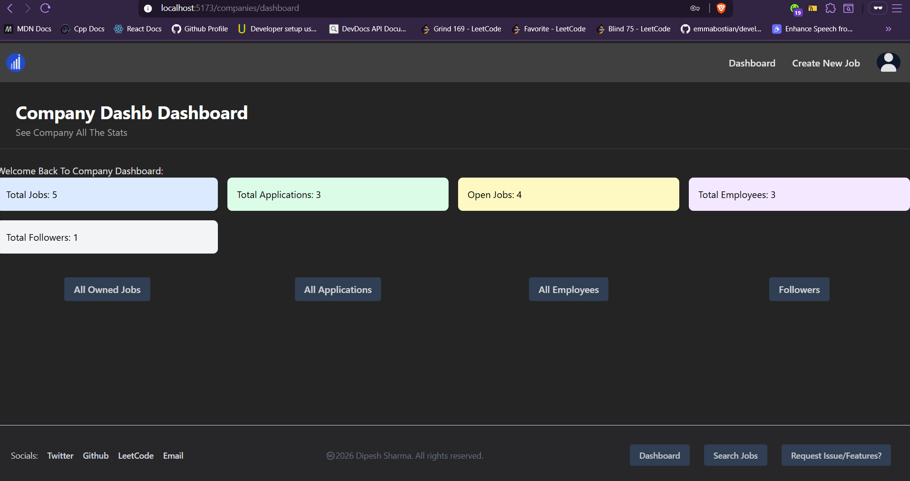
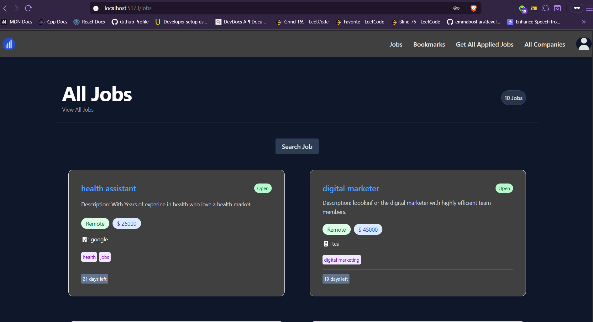
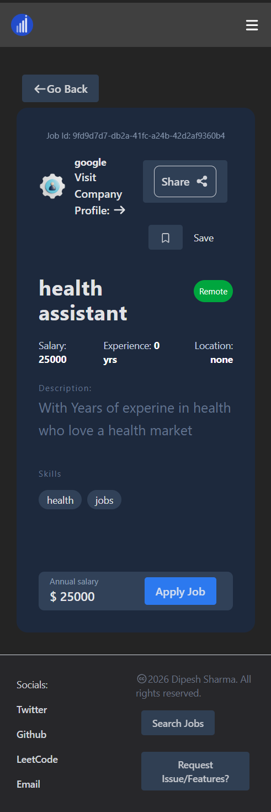

# Yeti Jobs:
Full stack Job Portal **Connecting** job **seekers** to recruiters with smart search, built with PERN stack, scalable job posting, resume analysis, real-time application management.

<p align="center">
    <picture>
        
    </picture>
</p>
<p align="center">
  <strong>Climb your career like a Yeti climbs a mountain.</strong>
</p>

## Overview:
The Project is a Job Portal Platform **with** all the features needed to build a job portal platform, such as CRUD operations, **role-based** access control, jobs, companies, apply, withdraw, create a job, create a new company, admin controller, and a cron queue.
- The Project can be **built** as a production level project with some minor things to do.
## Screenshots:
<div style="display: flex; justify-content: center; flex-wrap: wrap; gap: 10px;">
    
    
    
    
    
    
</div>

## Demo Url:
- Frontend: https://yeti-jobs.vercel.app
- Backend: https://yeti-jobs-server.vercel.app/api/v1


## Features:
1. Users:
  - Apply/Withdraw Job, Add/Bookmark
  - Search Jobs
  - Edit Profile And Other Credentials
  - Add a Resume, Profile Picture
  - See All Applied jobs
  - All Companies List
  - Individual Company jobs and Description About Company
  - view Job

2. Employees:
  - Company Dashboard
  - All Applicants
  - See All Jobs
  - See All employees
  - See Profile
  - Create/Delete/Edit a Job
  - Update Company
  - Change Applicant **Status**" 
  - Get All **Followers** Company

3. Admin:
   - Assign User to companies.
   - edit/delete/create/update Company
  - Company Entire Overview dashboard
  
4. Common:
  - Login
  - Signup
  - Verify Email
  - Reset Password
5. Authenticatoin:
  - JWT
  - **Role-Based** Access Control


## Tech Stack:
- Frontend:
  - React
  - TailwindCSS
- Backend:
  - Node.js
  - Express
- Database:
  - PostgreSQL
- Devops:
  - Docker


## Architecture Overview:
- The Project is built on top of the PERN stack with a layered architecture where I've used React for the UI state and Node/Express for backend (API, auth logic), PostgreSQL (data logic).
- with REST API **layers**, JWT for auth, and modular services for handling jobs, applications, companies, resume parsing, profile picture upload.
- With total more than **40** API endpoints with **proper** validation on both client and server side
- i've to make sure to addd the diagram of the  architecture.
 with also teh how frontend backend and db is interact


## Folder Structure

### Backend:
- app.js: Main file Which Runs Our Server
- controllers: All our business Logic
- Middleware: custom Middleware between two middleware for security.
- Models: Data Validation
- routes: All Routes
- services: External Business Logic
- utils: Reusable Function
### Frontend:
- api: All the Api calling to the server request
- assets: Images to used on the project
- auth: Validate Data
- components: Reusuable components
- context: UseContext central state mangment
- Data: Form of array static data which used multiple places
- hooks: Custom hooks such as fetching a data.
- lib: Axios Default Api
- pages: Final Output pages that client will see:
- services: Reusuable Function.


## Environement Variables:
### Backend:
  - Postgres: Relational Database
    - USER
    - PASSWORD
    - HOST
    - DATABASE_PORT
    - DATABASE
  - SUPABASE: Used to Host our Files
    - URL_SUPABASE_CONNECT
    - ANON_KEY_SUPABASE
  - NODEMAILER: Send Mail To Customer
    - NODEMAILER_MY_EMAIL  
    - NODEMAILER_MY_PASSWORD  
  - JWT: JSON Web Token (JWT) for securely signed tamper proof information
   - JWT_SECRET_KEY:
  - COMMON:  Client URL to server that only **requests** port and also **how long** our cache should **be** stored"
    ```diff
    + CLIENT_BASE_URL=http://localhost:5173
    - CLIENT_BASE_URL=https://vercel.app
    ```
    - PORT
    - MAXAGE

### Frontend:
  - VITE_SERVER_URL: Server url which we'll send a request
## 📦 Libraries Used

| Package | Version | Category |
| ------- | ------- | -------- |
| [](https://npmjs.com/package/react) | `19.2.0` | Frontend |
| [](https://npmjs.com/package/axios) | `1.13.5` | Frontend |
| [](https://npmjs.com/package/react-router) | `7.13.1` | Frontend |
| [](https://npmjs.com/package/react-icons) | `5.6.0` | Frontend |
| [](https://npmjs.com/package/react-toastify) | `11.0.5` | Frontend |
| [](https://npmjs.com/package/react-spinners) | `0.17.0` | Frontend |
| [](https://npmjs.com/package/tailwindcss) | `4.2.1` | Frontend |
| [](https://npmjs.com/package/express) | `^5.2.1` | Backend |
| [](https://npmjs.com/package/jsonwebtoken) | `^9.0.3` | Backend |
| [](https://npmjs.com/package/bcryptjs) | `^3.0.3` | Backend |
| [](https://npmjs.com/package/zod) | `^4.3.6` | Backend |
| [](https://npmjs.com/package/helmet) | `^8.1.0` | Security |
| [](https://npmjs.com/package/express-rate-limit) | `^8.2.1` | Security |
| [](https://npmjs.com/package/cors) | `^2.8.6` | Security |
| [](https://npmjs.com/package/multer) | `^2.0.2` | Upload |
| [](https://npmjs.com/package/nodemailer) | `^8.0.1` | Mail |
| [](https://npmjs.com/package/node-cron) | `^4.2.1` | Jobs |
| [](https://npmjs.com/package/pg) | `^8.18.0` | Database |
| [](https://npmjs.com/package/cookie-parser) | `^1.4.7` | Middleware |
| [](https://npmjs.com/package/dotenv) | `^17.3.1` | Config |
| [](https://npmjs.com/package/@supabase/supabase-js) | `^2.97.0` | Storage |


## Instalation & Setup:
- As It's based on the PERN Stack we've, required above all things to run our server.
- Requirements: **Node.js**, Postgres Server, Supabase Keys, Nodemailer Keys"

### Backend Configuration:
``` bash
  cd backend
  touch .env # Create Env File
  vim .env (Insert all the env keys on here)
```
- After inserting all the env keys
``` bash
npm i # Install all our node libraries
node app.js # Run our nodejs server
```


### Frontend:
``` bash
cd frontend
touch .env
vim .env
```
- Insert a: VITE_SERVER_URL on .env file.

``` bash
 npm i:  # Install all our node libraires
 npm run dev  # load our react page to browser
```

>:white_check_mark: your client page will run on the http://localhost:5173


## Docker Setup:
- Dockerbase have only one single container of the nodejs configuration.
- 


## Api Documentation:
- example with: post/api/v1/auth/login


## Database Design:
- For the Database Design, I made sure to have separation of concerns with only single tables doing a single task, not multiple.
<details>

<summary> Database Tables:</summary>
- applications
- companies
- email_verified
- jobs
- saved_jobs
- user_companies_follows
- users


### Application Table:
- The Table is mainly for **tracking** all **applied** jobs which have mostly user id and job id as a **foreign** key.
- with other relevant information such as: cover letter, notice period, expected salary, why we should hire you. **Two are mandatory** (cover letter, notice period) and the other two are optional

### Companies Table:
- all the list of the companies which exist on the platform with their relvent other information.
- with teh routes of: `admin` which only accessible to the role of teh admin.

### Email Verified Table:
- for track the email verified users, and also have the when user is try a forget password i've also store on teh email verified tables.
- with the enum type whether email verify or forget password with link to the user id and teh random code and relevent other information.

### Jobs Table:
- jobs is one of the most importatn table, which content lot of column on the single table.
- with the company id to teh user id who created and other basic jobs such as title, desc, salary, type and lot more.

### Saved jobs Table:
- with user have the option to bookmark a any jobs.
- on the bookmark with foreign relation of teh jobs and the user id and otehr relevent info.
### User Companies Follow or Followers Table:
- with i've add the lately of the following and the followers system for the following only company and by only the users.

### Users Table:
- with the user info and also the role whehter the user is guest, admin or the recruiter.
- with the profile pic and also teh resume have.
- education skills and the company id which only be valid for the enum recruiter.
- and lot of other information.
### Extra
- have a trigger and also the index operation on the database
- with the enum for the education, role and other information.
- Have the Muliple level of constraint/check to validate a inserted data with the data integrity.
- with also i use the `on delete cascase or on delete restrict` on the foreign relation if the foreign relation data is delete dshould we allow that linked data to be deleted or what.

</details>

## Cron Task:
- The cron task mean it'll run on that particular time which we've specified.
the operation that I'm using cron for is on jobs which have an **expiry** time of 30 days, which checks every night at **midnight**.
- on the every noon cron node check whterh the jobs time have expired or not if expired change the that job set to teh closeed of is_job_active


## Testing:
- As of now I **have** no testing. I plan to add integration testing with Jest and Supertest.
- if it's become a time constraint for me only main routes such as: `login, signup, jobs, new jobs` will have the testing but it might take time as i'm currently learning a Testing Fundmental.

## Deployment:
- for the deployment i'm plan to use the `vercel` for the both frontend and the backend project.
- which vercel nowdays support also the backend also have the backeup option of the render but that is too slow.
- for the database i'm planning to use: `supabase/neon` let's see which one i will choose for my postgres db.
- for the frontend no doubt i'll be usiing the vercel.

## Security:
- use **Helmet** for the response purpose which removes **X-Powered-By** so the client will not know which framework we've built with.
### validatin Security:
- Every major table will have validation from Zod which **checks** the integrity of our data.
- beside teh client side validat, server side validation, i aloso make suer to add the database validatino,
- even if user bypass a both client and server validation it can't insert due to teh database validation.
- with checking a pattern, blank, min length max length which are common i've implemented.
- i make sure to every single data to enforce the database integrity.


### System Security:
- The Most important thigns that i added here is the rate limiting.
> Security
>> Rate limiting: 200 req/min globally
>>> Reset password: 2 req/min strictly
- also add the rate limiting for the reset password and the forget password only can send the request twice per minute which enforce tha lot of times that user can't send the request.
- use the helemtn for the reponse purpose which remove teh x powered by that the client will nto knwo which frameworkd we've build without this it'll show it build from the express.
 - and also haev one more feature ao it alls the 12 more repsonse header, for better secuirty epurpsoe of prevent from teh xss attack.
- Use the cors for only allow my client url dont' allow any external api endponkts which also have a better security featuer.s


### Middlewares:
- i make sure to validate every incomonign  request to the both cilent side and the server side have teh middleware.
#### Client Valdiation:
- on the client valdiation guest cant' visit the page of the admin dashboard and the other admin restricted page and also teh employee restricted page.
- while the employees only restrict to perfomr a employee cant' apply to teh jbos or can't perfmor a the neither a guest or the admin action.
- admin which have little bit of the freedom but also enforce  cant' visit the page of the guest or the employee action.
#### Server MIddleware:
- i've more than the 9 middleware for the server validation.
- with make the controller user action to teh only isJobSekkker, companeis contoller to teh isEmployee and the admin contoller tot eh ony isAdmin.
- with i also valdiation whether the use is logged in or not, and also whter the user logged in but not verified, whtehr teh user is owner of that routes or not, whetehr the user given a correct uuid which i also validatino that also save some time for invalid ui to check from teh database.


<h2 align="center">⚡ Performance Optimization</h2>
- for the perfomacne i've make sure that
- add the indexing purpose which use to query a any data with teh faster time.
- Add the lazy loading and also the suspense loading for only fetch data when needed dont' request to server when don't need that.
- use the useContext for centralize  for the check a whether a user is verifed, logged in and the user role.
- Used the Pagination for the preofmrance optimization for the jobs specifally.
- i make sure indexing a search query that also do the faster operation.
- i've ized my signup of the: `dns/promises` using a library of in build to verify a whether the given user email domain is valid or nto before even try to send a mail.
- with rather then chekcing a entire select statement i've used a: `select exists(select 1)` which can be used for condition match return true and don't fetch all else false which also imporove the perofmaance of the system.


## Sclabality Considration:
- For scalability consideration, it's a very scalable system. Done proper API versioning and follow the MVC pattern for building a REST architecture.
- with done the proper api versisong and teh follow the mvc (mrc) pattern for buildign a rest architecture.
- With have the global error handling on the both client and server error event if it's error occured it'll catch and dont' crash a system on teh both side.
- Use PostgreSQL full text search with GIN index for searching jobs, which bypasses prefix search from ILIKE
-  on the every request it's sending a correct message as well with also the correct status code which range from 200, 400, 500.
- check teh multiple command such as join, group by, nested query witht eh : `explain analyze` for the perofmance analysis which can have the faster query.
- 

## Known Issue:
- The Major Issue i've only faced on only on teh ui design.
- with only the minor patch issue face on the backend.
- while on the frontend especially Tailwind CSS has known issues specifically with position and display.
- Sometimes PostgreSQL `$1` placeholder doesn't work as expected, requiring template literals, but this has SQL injection risks which I prevent by validating user input.
- during a building a email template for the backend i've also face a lot of issue on there.
- One Issue that i sitll have is, for sending a mail, iv'et eh synchrounous, mean i'm not waiting for that request, as but when the email is invalid it's tryign to send a mail that still a issue.
 - i can use the `promise.all` which i'm plan to use for the better perofmace 
-  during the email resend token, i've to make sure send the updated token, rather i'm sending a old token.
- with i make sure to send the: `withCredntiatils` from the frontend on the every request which i use teh axios create function for sending at oncee.
- for sending a file i've to mandatory to send a file on the: `formData` which sometmes it becmoe a silent error.


## LImitation:
- as i'm using a everywher the free tier for database/MAU at one time, which is efficient for the smaller student level projects.
-

## Someting Go Beyond Features:
- i've make sure to dockerize my sytem with also ignore some files that dont' needed.
- as of now i only dockerize to teh nodejs, coming days might be also teh dbms let's see.
- also have the controller and also the abot feature if the request takes longer time dont' wat for more than  a 10 sec.
- now on the react 19 we dont' need: `auth.provider rather it also work a auth` 
- use the portal system for the popup of the some features.
- for previous a page on the profile picturee of the resume to change it i can use: `createObjectURL` to print show it.
- add the vercel analytics for the get the stats about the frontend application.


> [!NOTE]
> ## Future Improvements:
>-  Add notification/email when a company posts a new job.
> - Real-time chat between recruiters and applicants.
> -  Move from useContext to Redux. 
> - Add logging/monitoring/observability. 
> - Socket.io for real-time features.
> - ATS scoring for any user profile with background jobs queue.
> - interview scheduling system with automated email reminders and video call link generation from Google Calendar API.
> - User can add a their employment_history and shows that employment history to the user page.
> - List of the education history with the college cgpa and degree.
> - Resume parsing Analysis with extract skills education from: `pdf-parser` library.
> - Alert a user only to those which user followed their company with new jobs, must be the background jobs else it'll block the main block.
> - Add the notification page list about notified user about recent events, followed companies notification, recruiter viewed your resume.
> - profile completneess score based on the badged applicant top skills and how much active jobs seeker.
> - On the edit content page if user try to submit a content without any change don't allow them which reduce a less backend request.


# Thanks 


<div align="center">

<div align="center">
  <a href="https://yeti-jobs.vercel.app">
    <picture>
      
    </picture>
  </a>
  <h1>Yeti Blues</h1>
<a href="https://github.com/tech-dipesh/yeti-jobs/issues"></a>
</div>


## Add this:
- postman collection link of the api endpoints documentatino link.
- testing even it's nto complete with mentodion my plan and coverae and frameword.
- with on the deployment of detilas production vs development setup, also 
  -- include the database migration steps.
